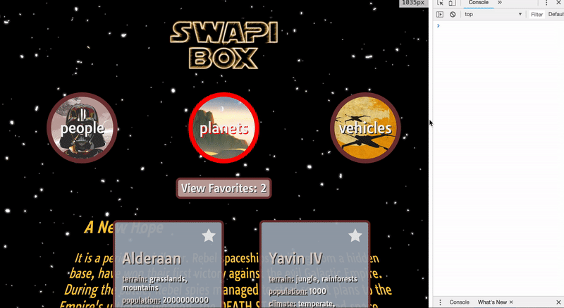

# SWAPIBox

Project to practice building out React components with added complexity and using [The Star Wars API](https://swapi.co/documentation). Fully tested application created with a modular structure and using [Create-React-App](https://github.com/facebook/create-react-app).

## Set Up

Clone this project

Run `npm install` from the root directory

Run `npm start` and visit localhost:3000 in your browser

You can run tests with `npm test`

## Project Goals

* Get comfortable whipping together React components with the additional complexity of implementing React Router.
* Write squeaky clean, well refactored code using ES6 syntax.
* Make informed design decisions to create a user-friendly application.
* Keep state based components to a minimum and leverage more functional components.
* Use a modular architecture for your application file structure.
* Think deeply about React Lifecycle Methods.
* Use propTypes for every component receiving props.

## Final Result
  

  
